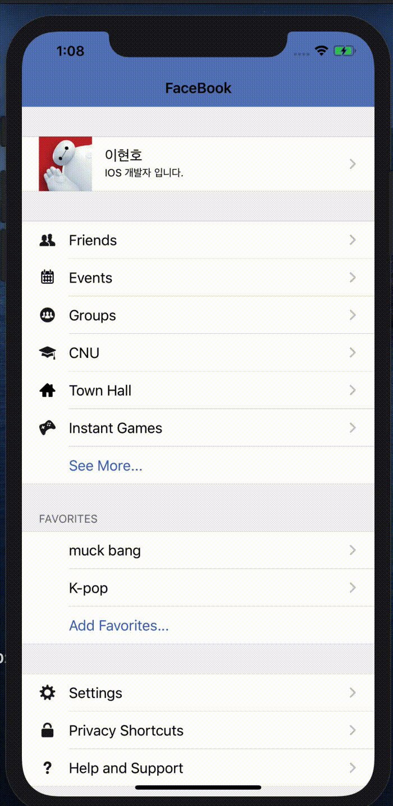

FacebookMe
==========

FacebookMe is the demo app of [Swift-30-Projects-03](https://github.com/soapyigu/Swift-30-Projects/tree/master/Project%2003%20-%20FacebookMe) . FacebookMe is a Swift App Mimics the personal profile tab of Facebook. It demos one simple way to implement a UITableView with mutiple sections and different types of cells.

## Screenshots

